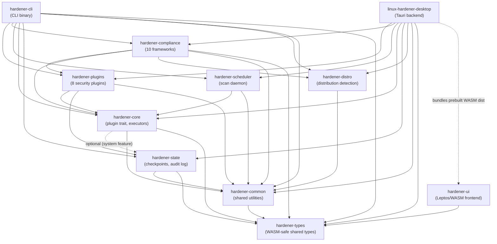

<p align="center">
  <picture>
    <source media="(prefers-color-scheme: dark)" srcset="docs/assets/logo-dark.svg">
    
  </picture>
</p>

<p align="center">
  <a href="https://github.com/tidynest/linux-system-hardener/actions/workflows/ci.yml"></a>
  
  
  
  
  
  
</p>

A comprehensive Linux security automation tool with multi-distribution support, built in Rust. Provides automated security scanning, hardening, and compliance reporting with full rollback capabilities.

---

## Screenshots

<p align="center">
  
</p>
<p align="center">
  
  
</p>

<p align="center"><sub>Desktop app (Tauri + Leptos) on the Midnight Teal theme — Dashboard, Security Analysis, and System Hardening from a live host scan.</sub></p>

---

## Contents

- [Overview](#overview)
- [Features](#features)
- [Project Status](#project-status)
- [Architecture](#architecture)
- [Getting Started](#getting-started)
- [Usage](#usage)
- [Configuration](#configuration)
- [Security Considerations](#security-considerations)
- [Contributing](#contributing)
- [Roadmap](#roadmap)
- [License](#license)

---

## Overview

Linux System Hardener automates the process of securing Linux servers and workstations by:

- **Scanning** systems for security misconfigurations
- **Applying** hardening recommendations automatically
- **Rolling back** changes safely using checkpoint snapshots
- **Reporting** compliance status against CIS, STIG, NIST 800-53, PCI-DSS,
  HIPAA, GDPR, ISO/IEC 27001:2022, SOC 2 (Trust Services Criteria),
  NIST SP 800-171 Revision 3 (Controlled Unclassified Information) and
  FedRAMP (Moderate Rev 5 baseline of 800-53 controls) —
  findings are mapped to each framework's
  controls (controls the engine cannot automatically assess are flagged for
  manual review rather than assumed compliant). RHEL-10-family hosts are
  assessed against DISA RHEL 10 STIG V1R1 and CIS RHEL 10 Benchmark v1.0.1
  identifiers automatically (`--profile` overrides)

The tool is designed for system administrators, DevOps engineers, and security professionals who need to maintain secure Linux infrastructure at scale.

---

## Features

### Security Plugins (8 Implemented)

| Plugin | Description | Status |
|--------|-------------|--------|
| **Kernel Hardening** | sysctl security parameters (ASLR, ptrace, etc.) | ✅ |
| **SSH Hardening** | OpenSSH configuration security | ✅ |
| **Firewall Hardening** | nftables/firewalld/ufw rule management | ✅ |
| **PAM Authentication Hardening** | Pluggable Authentication Modules | ✅ |
| **Service Minimisation** | Disable unnecessary services | ✅ |
| **Audit Rules Hardening** | auditd rules and configuration | ✅ |
| **File Permissions Hardening** | File permission security | ✅ |
| **MAC System Hardening** | SELinux/AppArmor configuration | ✅ |

<sub>✅ = complete</sub>

### Core Infrastructure

- **Checkpoint System**: SQLite-backed state snapshots with Ed25519 cryptographic signatures
- **Full Rollback Support**: All plugins integrate with checkpoint system for safe rollback
- **Hash Chain Audit Logging**: Tamper-evident audit trail with cryptographic linking
- **Plugin Manager**: Dependency-aware plugin execution with topological sorting
- **Distribution Detection**: Automatic detection of Debian, Red Hat, Arch, and SUSE families

### Multi-Distribution Support

| Distribution | Package Manager | Init System | Status |
|--------------|-----------------|-------------|--------|
| Ubuntu 22.04 LTS+ (incl. 26.04) | apt | systemd | ✅ |
| Debian 12+ (incl. 13 "Trixie") | apt | systemd | ✅ |
| Fedora 40+ (incl. 44) | dnf | systemd | ✅ |
| RHEL 9+ (incl. 10) | dnf | systemd | ✅ |
| Arch Linux (rolling) | pacman | systemd | ✅ |
| openSUSE Leap 15.6 / 16, Tumbleweed | zypper | systemd | ✅ |

<sub>✅ = supported</sub>

> Support is **family-based**: detection maps any release of the Debian, Red Hat,
> Arch or SUSE families to the same hardening behaviour, so current releases
> (Debian 13, Ubuntu 26.04, Fedora 44, RHEL 10, openSUSE Leap 16) are covered
> automatically. openSUSE Leap 15.x reached end-of-life in April 2026; use Leap
> 16. See [docs/DISTRIBUTION_VALIDATION.md](docs/DISTRIBUTION_VALIDATION.md) for
> the specific versions last validated end-to-end.

### User Interface

- **Desktop Application**: Tauri-based native app with Leptos (Rust) frontend
- **Web Interface**: Runs in browser via Trunk (WASM)
- **Dark Terminal Theme**: Professional security-focused aesthetic with colour-coded severity states (7 themes including WCAG AAA High Contrast)
- **Keyboard Navigation**: Full keyboard control — Ctrl+1-5 (pages), Alt+T (themes), Escape (close), F11 (fullscreen), Arrow keys (tabs and grids)
- **ARIA Accessibility**: WAI-ARIA tabs, skip link, `aria-selected`, `aria-live` regions, focus management
- **Progressive Disclosure**: Simple overview with drill-down for details
- **Real-time Feedback**: Live scan progress and results
- **Multi-host Fleet View** (desktop): A read-only **Fleet** page scans several
  saved inventory hosts concurrently and shows each host's severity posture —
  per-host critical/high/medium/low/info tallies and a colour-coded CIS
  compliance score — and expands to reveal that host's findings plus a
  per-framework compliance breakdown (pass/fail/manual/NA counts).

---

## Project Status

**Current Phase**: Production Release (v1.2.2)

### Test Coverage

```
Rust workspace:  750+ passed · 0 failed · 38 ignored   (>90% coverage)
GUI / desktop:   113 Playwright (Web UI, 5 distros) · 95 desktop (UX + functional) · 21 Node.js
```

### Build Status

- Workspace compiles without warnings
- All clippy lints pass
- rustfmt applied consistently

---

## Architecture

Direct dependencies between the workspace crates (dotted = optional feature or
WASM bundling rather than a Cargo dependency):



<details>
<summary>Directory layout</summary>

```
linux-system-hardener/
├── crates/
│   ├── hardener-types/       # WASM-compatible shared type definitions
│   ├── hardener-common/      # Shared utilities and error types
│   ├── hardener-core/        # Plugin trait, context, config system
│   ├── hardener-distro/      # Distribution detection and adaptation
│   ├── hardener-plugins/     # Security plugin implementations (8 plugins)
│   ├── hardener-state/       # Checkpoint manager, audit logging
│   ├── hardener-compliance/  # Compliance framework mapping (10 frameworks)
│   ├── hardener-scheduler/   # Scheduled scanning daemon
│   ├── hardener-cli/         # Command-line interface binary
│   └── hardener-ui/          # Leptos WASM frontend components
├── src-tauri/                # Tauri backend (desktop app)
├── scripts/                  # Development and testing utilities
└── docs/                     # Project documentation
```

</details>

### Key Design Principles

- **Security First**: Runs with minimum necessary privileges, comprehensive input validation
- **Safe by Default**: All changes are reversible via checkpoint system
- **Distribution Agnostic**: Abstracted package managers, init systems, and MAC frameworks
- **Modular Architecture**: Plugins are independent and can be developed/tested in isolation

---

## Getting Started

### Install from AUR (Arch Linux)

```bash
# Using an AUR helper (e.g. paru, yay)
paru -S linux-system-hardener

# Or manually
git clone https://aur.archlinux.org/linux-system-hardener.git
cd linux-system-hardener
makepkg -si
```

This installs both the `hardener` CLI and the `linux-hardener-desktop` GUI application.

### Run with Docker (scan and report only)

A minimal `FROM scratch` image carrying only the static `hardener` binary can
audit the host read-only:

```bash
# Build from the repository root
docker build -f packaging/docker/Dockerfile -t linux-system-hardener .

# Read-only scan of the host's config surface
docker run --rm --pid=host \
  -v /etc:/etc:ro -v /var/log:/var/log:ro -v /usr/lib:/usr/lib:ro \
  linux-system-hardener scan --format json
```

Scan and report run read-only against the mounted host state.
`systemctl`/D-Bus-dependent checks (services, parts of audit/MAC/firewall)
degrade to tool-unavailable findings rather than lying, and `apply` is
unsupported in a container by design — it would need `--privileged` plus host
namespaces, defeating the isolation. Details in
[`packaging/docker/README.md`](packaging/docker/README.md).

### Prerequisites (Building from Source)

- Rust 1.85+ (with `wasm32-unknown-unknown` and `x86_64-unknown-linux-musl` targets)
- Linux system (for full functionality)
- Root access (for applying hardening changes)
- `musl` toolchain (for static CLI binary)

### Build from Source

```bash
# Clone repository
git clone https://github.com/tidynest/linux-system-hardener.git
cd linux-system-hardener

# Build all crates
cargo build --release

# Run tests
cargo test

# Build desktop application (requires Tauri CLI)
cargo install tauri-cli --version "^2"
cargo tauri build
```

### Development Setup

```bash
# Install development dependencies
rustup target add wasm32-unknown-unknown
cargo install trunk

# Run desktop app in development mode (requires polkit for privilege escalation)
cargo tauri dev

# On Wayland (Hyprland, Sway, etc.), use this workaround:
WEBKIT_DISABLE_COMPOSITING_MODE=1 cargo tauri dev

# Run web UI in development mode (browser - no Tauri required)
cd crates/hardener-ui && trunk serve --port 1420
# Open http://127.0.0.1:1420/ in your browser

# Browser automation via Playwright MCP (recommended for UI testing)
# Configure playwright-brave in .mcp.json, then use mcp__playwright-brave__browser_navigate
# See MCP_INSTRUCTIONS.md for complete setup instructions
```

### Development Workflow Commands

```bash
# Validate documentation is in sync with code
./scripts/validate_all.py           # Full validation
./scripts/validate_all.py --quick   # Fast check (skips slow validators)

# Auto-fix documentation (safe, idempotent)
./scripts/update_all_docs.py        # Preview changes
./scripts/update_all_docs.py --apply # Apply changes

# Check naming conventions
./scripts/validate_naming.py

# Release workflow
./scripts/release.sh --verify       # Check version consistency
./scripts/release.sh patch --dry-run # Preview release
./scripts/release.sh patch          # Actual release
```

See [scripts/README.md](scripts/README.md) for complete script documentation.

### Safe Root Testing

The hardener modifies critical system files. For safe testing with root privileges, use the provided container scripts:

```bash
# 1. Create isolated Arch Linux container (systemd-nspawn)
sudo ./scripts/create-test-container.sh

# 2. Enter container (project mounted at /project)
sudo ./scripts/create-test-container.sh enter

# 3. Inside container: build and run tests
cd /project
cargo build --release

# Run safe tests (read-only + dry-run)
sudo ./scripts/root-test-suite.sh

# Run full tests INCLUDING apply + rollback
sudo ./scripts/root-test-suite.sh --apply

# 4. Exit and clean up
poweroff                                       # Exit container
sudo ./scripts/create-test-container.sh clean  # Remove container
```

**Why two test modes?**

| Test | Without `--apply` | With `--apply` |
|------|-------------------|----------------|
| Scans, reports, daemon, history | Runs | Runs |
| Apply hardening + rollback | Skipped | Runs |

The `--apply` flag explicitly enables destructive tests. Without it, only read-only tests run. This prevents accidentally modifying configs. **Inside the container, both modes are completely safe** since it's isolated from your host system.

**GUI tests** can be run separately or alongside CLI tests:

```bash
# Run 113 Playwright Web UI tests across all 5 distros
sudo ./scripts/run-gui-tests.sh

# Or combine with CLI tests using the --gui flag
sudo ./scripts/run-cross-distro-tests.sh --apply --gui
```

See [docs/DISTRIBUTION_VALIDATION.md](docs/DISTRIBUTION_VALIDATION.md) for full test documentation.

#### Web App vs Desktop App

The web app runs in any browser without needing Tauri installed:

| Feature | Web App (Browser) | Desktop App (Tauri) |
|---------|-------------------|---------------------|
| Run security scans | ❌ UI only | ✅ Full functionality |
| Apply hardening | ❌ UI only | ✅ With pkexec |
| Generate reports | ❌ UI only | ✅ Full functionality |
| Navigate pages | ✅ Works | ✅ Works |
| Dark terminal theme | ✅ Works | ✅ Works |

The web app is useful for UI development and testing. All pages render with proper empty states.

---

## Usage

### Command Line

The commands you will use most:

```bash
hardener plugins                        # List available security plugins
hardener scan                           # Scan the system for security issues
hardener scan --format json             # Machine-readable scan output
hardener report --framework cis         # Compliance report (10 frameworks)
sudo hardener apply --dry-run --all     # Preview hardening without changing anything
sudo hardener apply --all               # Apply all recommended hardening
hardener checkpoint list                # List rollback checkpoints
sudo hardener rollback <checkpoint-id>  # Roll back to a checkpoint
hardener history list                   # Recent scan sessions
```

Every verb in detail:

<details>
<summary><code>hardener plugins</code> — list available security plugins</summary>

```bash
# List available security plugins
hardener plugins
```

</details>

<details>
<summary><code>hardener scan</code> — scan the system for security issues</summary>

```bash
# Scan system for security issues
hardener scan

# Scan with severity filter (critical, high, medium, low, info)
hardener scan --severity high

# Scan specific plugins only (full ID or short name)
hardener scan --plugin kernel-hardening --plugin ssh-hardening
hardener scan --plugin kernel --plugin ssh  # Short names also work

# Output as JSON
hardener scan --format json

# Use custom config file
hardener scan --config /path/to/config.toml

# Audit mode - ignore all config, pure security assessment
hardener scan --audit

# Compliance mode - only show policy violations (no valid exception)
hardener scan --compliance

# CI/CD mode - exit with code 1 if findings exist
hardener scan --compliance --exit-code
```

</details>

<details>
<summary><code>hardener apply</code> — apply hardening recommendations (dry-run available)</summary>

```bash
# Dry-run: see what would be changed without applying
sudo hardener apply --dry-run --all

# Apply all recommended hardening
sudo hardener apply --all

# Apply specific plugin
sudo hardener apply --plugin kernel-hardening
```

</details>

<details>
<summary><code>hardener rollback</code> — restore a previous checkpoint</summary>

```bash
# Rollback to a previous checkpoint
sudo hardener rollback <checkpoint-id>
```

</details>

<details>
<summary><code>hardener report</code> — compliance reports against 10 frameworks</summary>

```bash
# Interactive report wizard
hardener report --interactive

# Generate report in different formats
hardener report --framework cis --report-format html --output report.html
hardener report --framework cis --report-format csv --output report.csv

# Force a compliance ID profile (auto-detected from the scanned system otherwise)
hardener report --framework stig --profile rhel10
```

</details>

<details>
<summary><code>hardener checkpoint</code> — create and inspect state snapshots</summary>

```bash
# Create a checkpoint before making changes
sudo hardener checkpoint create "before-hardening"

# List all checkpoints
hardener checkpoint list

# Show checkpoint details
hardener checkpoint show <checkpoint-id>
```

</details>

<details>
<summary><code>hardener history</code> — browse and export past scan sessions</summary>

```bash
# View scan history (list recent sessions)
hardener history list

# View history with filters
hardener history list --limit 50 --status completed
hardener history list --host server1

# Show details of a specific scan session
hardener history show <session-id>

# Export scan session to JSON file
hardener history export <session-id>
hardener history export <session-id> --output /path/to/export.json
```

</details>

<details>
<summary><code>hardener daemon</code> — run the scheduled scanning daemon</summary>

```bash
# Start the scheduled scanning daemon
hardener daemon start

# Run a single scan immediately (without scheduler)
hardener daemon run-once

# Show scheduler status and scan history
hardener daemon status --limit 10
```

</details>

<details>
<summary><code>hardener systemd</code> — generate and manage systemd timers</summary>

```bash
# Generate systemd unit files (outputs to stdout)
hardener systemd generate

# Generate with custom schedule (cron or systemd calendar format)
hardener systemd generate --schedule "0 2 * * *"

# Install systemd timer (requires root for system, or use --user)
sudo hardener systemd install
hardener systemd install --user

# Check systemd timer status
hardener systemd status

# Remove systemd timer
sudo hardener systemd uninstall
```

</details>

### SSH Remote Scanning

```bash
# Scan a remote host
hardener --ssh user@hostname scan

# Scan with specific SSH key
hardener --ssh admin@192.168.1.100 --ssh-key ~/.ssh/id_ed25519 scan

# Apply hardening remotely
sudo hardener --ssh root@server apply --all

# Generate compliance report from remote host
hardener --ssh root@server report --framework cis --report-format pdf
```

See [docs/SSH_REMOTE_SCANNING.md](docs/SSH_REMOTE_SCANNING.md) for complete SSH documentation.

### Multi-host / Fleet Commands

Batch subcommands run against many hosts concurrently using the inventory
(`~/.config/linux-hardener/hosts.toml`) or ad-hoc `--ssh` targets.

```bash
# Scan all inventory hosts and emit JSON for CI
hardener --format json batch scan --all

# Scan two named hosts with higher parallelism
hardener batch scan --host web-01,db-02 --concurrency 16

# Assess the entire fleet against CIS and print a posture table
hardener batch report --all --framework cis

# Preview hardening across the fleet (dry-run — no changes made)
hardener batch apply --all

# Apply to two hosts, four at a time
sudo hardener batch apply --host web-01,web-02 --execute --concurrency 4

# Preview a fleet-wide rollback of the SSH hardening (dry-run)
hardener batch rollback --all --plugin ssh

# Roll the SSH change back on two hosts
sudo hardener batch rollback --host web-01,web-02 --plugin ssh --execute
```

`batch apply` is **dry-run by default**: it validates each host and reports what
would change without making any modifications. Pass `--execute` to perform real
changes. Each host is privilege-probed before executing; a host without uid 0 or
passwordless `sudo` is isolated as failed while the rest proceed unaffected.

`batch rollback` restores each host to the latest per-plugin checkpoint that
`batch apply` captured. It is **dry-run by default** too: bare `batch rollback`
previews which checkpoint(s) would be restored per host; `--execute` performs the
restore. Restores are host-keyed (a host's checkpoint is never applied to another
host) and privilege-gated on `--execute`.

### Desktop Application

1. Launch the application
2. Click "Run Security Scan" to analyse your system
3. Review findings by severity (Critical, High, Medium, Low, Info)
4. Select hardening recommendations to apply
5. Click "Apply Selected" (requires root password)
6. Use "Checkpoints" to rollback if needed

**Keyboard shortcuts:**

| Shortcut | Action |
|----------|--------|
| Ctrl+1-5 | Navigate to Dashboard/Analysis/Hardening/Remote/Scheduler |
| Alt+T | Cycle through themes |
| Escape | Close detail panels, exit fullscreen |
| F11 | Toggle fullscreen |
| Arrow keys | Navigate tab bars and findings grid |
| Enter/Space | Open finding detail |

The desktop app has seven pages. `Ctrl+1`–`5` cover the first five (Dashboard,
Analysis, Hardening, Remote, Scheduler); the two multi-host pages — **Fleet**
(read-only fleet scan) and **Fleet Apply** (apply/roll back across hosts) — are
reached from the navigation bar and have no dedicated shortcut yet.

---

## Configuration

### Config File Locations

Configuration is loaded from multiple sources (later overrides earlier):

1. **System config**: `/etc/linux-hardener/config.toml`
2. **User config**: `~/.config/linux-hardener/config.toml`
3. **CLI config**: `--config /path/to/file.toml`
4. **Environment**: `HARDENER_*` variables

### Basic Configuration

```toml
# ~/.config/linux-hardener/config.toml

[global]
# Plugins to explicitly disable
disabled_plugins = ["mac"]

[ssh]
enabled = true

[kernel]
enabled = true
```

### Policy Exceptions

Document deviations from secure baseline with audit metadata:

```toml
[ssh.exceptions.PasswordAuthentication]
value = "yes"
allowed = true
reason = "Legacy LDAP integration until Q2 2027 migration"
approved_by = "security-team@company.com"
approved_date = "2026-11-01"
ticket = "SEC-1234"
expires = "2027-06-30"
```

### Scan Modes

- **Default** (`hardener scan`): Shows all findings with policy annotations
- **Audit** (`hardener scan --audit`): Ignores config, pure security assessment
- **Compliance** (`hardener scan --compliance`): Only shows policy violations

### Checkpoint Location

Checkpoints are stored in:
```
~/.local/share/linux-hardener/checkpoints.db       # regular user
/var/lib/linux-hardener/checkpoints.db              # when running as root
```

---

## Security Considerations

### Privilege Model

- **Scanning**: Runs as regular user where possible
- **Applying Changes**: Requires root privileges
- **Checkpoint Storage**: User-owned SQLite database with signed entries

### Threat Model

This tool is designed to harden systems against:
- Kernel-level exploits (via sysctl hardening)
- Network attacks (via firewall configuration)
- Privilege escalation (via PAM and permission hardening)
- Lateral movement (via service minimisation)
- Audit evasion (via comprehensive logging)

### Known Limitations

- Changes require system reboot to fully take effect in some cases
- Some hardening may break specific applications (test in staging first)
- SELinux/AppArmor policies are detected but not fully managed

---

## Contributing

Contributions are welcome! Please see [CONTRIBUTING.md](CONTRIBUTING.md) for guidelines.

### Development Standards

- Follow naming conventions in [docs/NAMING_CONVENTIONS.md](docs/NAMING_CONVENTIONS.md)
- All code must pass `cargo clippy` without warnings
- Maintain >90% test coverage for new code
- Use British English in documentation and user-facing text

---

## Roadmap

See [ROADMAP.md](ROADMAP.md) for detailed implementation plans for upcoming features.

<details>
<summary><b>Release history — v0.2.0 → v1.0.0</b> (click to expand)</summary>

### ✅ v0.2.0
- [x] Config file support (`~/.config/linux-hardener/`)
- [x] CLI flags: `--config`, `--audit`, `--compliance`, `--exit-code`
- [x] Policy exception system with audit trail
- [x] Interactive report wizard (`hardener report --interactive`)
- [x] CSV and HTML format support in CLI
- [x] PDF report formatter with automatic timestamped filenames and colour-coded badges
- [x] GUI compliance report page

### ✅ v0.3.0
- [x] SystemExecutor abstraction layer for local/remote operations
- [x] Remote scanning via SSH
- [x] SSH CLI flags: `--ssh`, `--ssh-key`, `--port`, `--ssh-timeout`, `--ssh-no-verify`
- [x] MockExecutor for unit testing
- [x] All plugins converted to async
- [x] SSH remote scanning documentation
- [x] Scheduled scanning daemon with tokio-cron-scheduler
- [x] CLI daemon commands: `start`, `run-once`, `status`
- [x] Notifications (email via SMTP, webhooks for Slack/Discord/generic)
- [x] Systemd timer generation (`hardener systemd generate/install/uninstall/status`)
- [x] History CLI commands (`hardener history list/show/export`)
- [x] WASM compilation fix (hardener-types crate for WASM-safe dependencies)
- [x] GUI dark terminal theme with CSS styling
- [x] Browser mode support (Web UI works without Tauri desktop wrapper)
- [x] CI/CD GitHub Actions integration

### ✅ v0.3.1 - GUI Polish & Testing
- [x] Fix "Loading..." text persistence
- [x] GUI dark terminal theme with CSS Variables
- [x] Security score shows "--/100" before scan
- [x] Fix View Findings button styling
- [x] State persistence via SQLite storage
- [x] Browser mode fix (Tauri availability check)
- [x] Timestamp formatting on Checkpoints page
- [x] Background colour personalisation (5 security-focused themes)
- [x] Responsive layout for varying screen resolutions
- [x] Navigation restructure (5 pages: Dashboard, Analysis, Hardening, Remote, Scheduler)
- [x] GUI functional testing
- [x] CLI functional testing (97 tests: 31 unit + 66 functional)
- [x] Safe testing environment (systemd-nspawn container)

### ✅ v0.3.2 - GUI Major Redesign
- [x] Page redesign (Dashboard, Analysis, Hardening restructured with new layout and accessibility)
- [x] Session 1: Overflow fixes, skip link, tab ARIA accessibility
- [x] Session 2: CSS utility classes (flex/grid/gap), responsive testing (320-1920px)
- [x] Session 2: Card component standardisation
- [x] Session 3: Colour contrast audit (WCAG AA), theme switching UI
- [x] Session 4: Empty states, CSS transitions, hover animations, E2E tests
- [x] Backend integration (Tauri commands connected)
- [x] Root privilege escalation via pkexec
- [x] Bug fixes: Security score calculation, false positives, validate() stubs, kernel rollback

### ✅ v0.3.3 - Distribution Validation
- [x] Arch Linux validation (123/123 tests pass) - covers Manjaro, EndeavourOS, Garuda
- [x] Debian 12 validation (123/123 tests pass) - covers Ubuntu, Linux Mint, Pop!_OS, elementary
- [x] Fedora 41 validation (123/123 tests pass) - covers RHEL, CentOS, AlmaLinux, Oracle Linux
- [x] Rocky Linux 9 validation (123/123 tests pass) - covers RHEL family
- [x] openSUSE Leap 15.6 validation (123/123 tests pass) - covers SLES

> **Note on family coverage:** Each distribution covers its entire family. All distributions in a family map to the same `DistroFamily` enum and use identical hardener code paths.

### ✅ v0.4.0 - GUI/CLI Parity & UI Polish
- [x] GUI/CLI feature parity (scan filtering, checkpoint CRUD, report export, scan history, audit/compliance modes)
- [x] Scheduler UI (schedule config, notification config, email/webhook, test notification)
- [x] Config file picker in desktop app
- [x] UI polish pass (side-by-side layouts, card standardisation, responsive fixes)
- [x] Severity filter in scan results
- [x] Multi-host management from single UI — **Fleet** scan view, compliance scores, **Fleet Apply** (apply/rollback), ad-hoc SSH targets, live scan progress, and per-host history
- [~] Historical security trends — CLI `history trends` shipped (per-host; see v1.2.0); desktop trends visualisation deferred
- [ ] Test on GNOME, KDE, XFCE desktop environments (pkexec/polkit agents) — deferred (human-run; CI validates headless nspawn containers only)

### ✅ v1.0.0 - Production Release
- [x] Security audit completed
- [x] Package distribution (AUR)
- [x] Comprehensive user documentation
- [x] Performance optimisation

</details>

### v1.2.0 - Multi-host & Compliance Depth (Released)
- [x] Multi-host batch CLI: `batch scan` / `report` / `apply` / `rollback` (concurrent, per-host isolated, tiered exit codes)
- [x] Per-host scan history, trends, and regression detection (`history trends/regressions --host`)
- [x] Scheduler regression alerts (`notify_mode`: findings / regression / both)
- [x] Remote-correct checkpoints (capture/restore through the executor; host-keyed; cross-host restore refused)
- [x] ISO/IEC 27001:2022 framework + multi-framework finding mappings (STIG/NIST/PCI-DSS/HIPAA/GDPR)
- [x] CIS coverage completion — 11 CIS controls now genuinely assessed (Pass/Fail); `report --framework cis` shows 6 ManualReview, down from 17
- [x] PAM/permissions assessment improvements — faillock/pwhistory use threshold comparison; shadow/gshadow use allowed-bits mask (never loosens stricter settings)
- [x] Desktop **Fleet** view — read-only multi-host scan posture with CIS compliance scores and per-framework breakdown
- [x] Fleet apply/rollback in the GUI — shells out to the audited `batch apply/rollback`; mandatory dry-run + confirm modal before any change
- [x] Polkit desktop-environment test tooling (`scripts/detect-polkit-agent.sh`, `test-polkit-matrix.sh`, DE-specific wrappers, `docs/de-compatibility.md`)

---

## License

This project is licensed under the Apache License, Version 2.0. See [LICENSE](LICENSE) for details.

---

## Acknowledgements

This project draws inspiration from established security tools including:
- [Lynis](https://cisofy.com/lynis/) - Security auditing tool
- [OpenSCAP](https://www.open-scap.org/) - Security compliance toolkit
- [CIS Benchmarks](https://www.cisecurity.org/cis-benchmarks) - Security configuration standards

---

**Author**: Eric Jingryd
**Contact**: tidynest@proton.me
**Repository**: https://github.com/tidynest/linux-system-hardener

**Last Updated**: 2026-07-17
