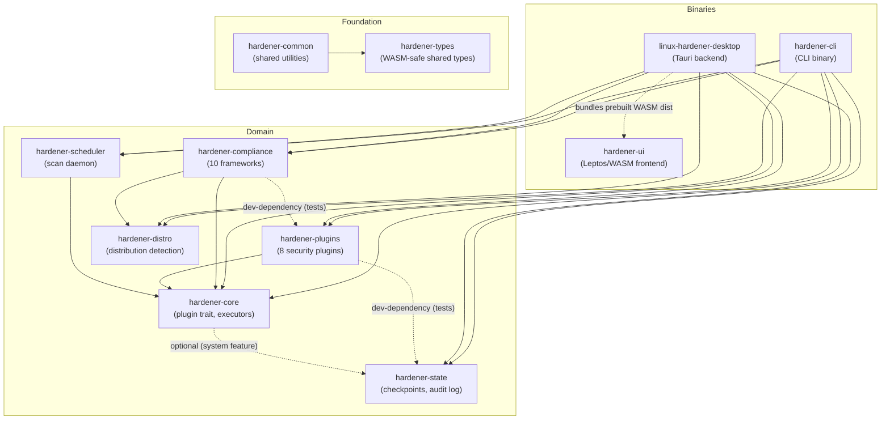

> ### Please update to 1.5.1
>
> **1.4.0 and earlier can delete account files during a rollback on a remote
> host.** If you manage remote hosts over SSH, do not run `hardener rollback`
> until you have upgraded. Local-only use was never affected. Details:
> [GHSA-x4xp-32mf-xwjh](https://github.com/tidynest/linux-system-hardener/security/advisories/GHSA-x4xp-32mf-xwjh).
>
> ### If you hardened an openSUSE host with 1.5.0 or earlier, check three files
>
> openSUSE keeps vendor configuration under `/usr/etc` and reserves `/etc` for
> your overrides, and that override replaces the vendor file **whole**, not
> setting by setting. Every release up to and including 1.5.0 created a
> three-line `/etc/login.defs`, which silenced the other 35 settings the vendor
> file makes, `ENCRYPT_METHOD` and `UMASK` among them. `ENCRYPT_METHOD` chooses
> the hashing algorithm for every password set afterwards. The same happened to
> `/etc/security/faillock.conf` and `/etc/security/pwhistory.conf`.
>
> Check whether any of the three is unexpectedly short:
>
> ```bash
> wc -l /etc/login.defs /etc/security/faillock.conf /etc/security/pwhistory.conf
> ```
>
> A file of a few lines where `/usr/etc` holds a long one is this bug. Restore
> the vendor file, then re-apply your intended values:
>
> ```bash
> sudo cp /usr/etc/login.defs /etc/login.defs
> ```
>
> **1.5.1 refuses to create these files rather than masking the vendor copy**,
> so openSUSE PAM hardening is declined until layered configuration is
> supported. Other distributions were never affected.
>
> ### If you filed or sent a compliance report, regenerate it
>
> A compliance report decides `Pass` from what a plugin declares it covers plus
> the absence of a finding. Up to and including 1.5.0, a plugin that produced no
> evidence therefore passed every control it covers, on the silence its own
> absence caused. From the command line this needed a plugin's scan to fail. **In
> the desktop it needed no failure at all**: disabling a plugin, or scanning a
> subset, was enough for every control of every plugin that did not run to be
> reported as satisfied.
>
> Any report you have kept, filed or forwarded may therefore state passes that
> were never assessed. Desktop users should regenerate unconditionally:
>
> ```bash
> sudo hardener report --framework cis
> ```
>
> From 1.5.1 a plugin that contributed no evidence reports its controls as
> **Manual Review** instead.
>
> ### If you hardened a host with 1.4.0 or earlier, check its password ageing
>
> Every release up to and including 1.4.0 wrote `/etc/login.defs` in a syntax
> the file does not accept, so `PASS_MAX_DAYS`, `PASS_MIN_DAYS` and
> `PASS_WARN_AGE` were left unchanged. A later scan read the tool's own
> discarded line and reported the host as compliant. **1.5.0 fixes both the
> writing and the reading**, and the fix is verified against the system itself
> rather than against the tool.
>
> Upgrading does not repair a host that was already hardened. The old file is
> still on disk, so you need to re-apply:
>
> ```bash
> sudo hardener apply -p pam-hardening
> ```
>
> To confirm, ask the system rather than the tool. Create a throwaway account
> and read what the system gave it, since `/etc/login.defs` supplies defaults
> for new accounts only:
>
> ```bash
> sudo useradd --no-create-home ageing-probe
> sudo chage -l ageing-probe | grep -i maximum
> sudo userdel ageing-probe
> ```
>
> A large number such as 99999 means the ageing policy is not in force. After
> re-applying on 1.5.0 or later it should read 90.
>
> ### Known issue: rollback does not restore systemd unit files
>
> In 1.5.0 and earlier, the services plugin records unit files in its
> checkpoint but the rollback allow-list does not cover the systemd unit
> directories, so `hardener rollback` aborts without restoring anything.
> Nothing is lost or damaged, but a service disabled by `hardener apply` must
> be re-enabled by hand:
>
> ```bash
> sudo systemctl enable --now <service>
> ```
>
> Fixed in 1.5.1.
>
> ---
>
> I am sorry for all of this. This is a tool you install to make a system
> safer, and in these cases it did the opposite. If any of it has cost you
> anything, I apologise. Known problems will be listed here as they are found,
> including the ones not yet fixed, so you can judge the risk yourself.

<p align="center">
  <picture>
    <source media="(prefers-color-scheme: dark)" srcset="docs/assets/logo-dark.svg">
    
  </picture>
</p>

<p align="center">
  <a href="https://github.com/tidynest/linux-system-hardener/actions/workflows/ci.yml"></a>
  
  
  
  <a href="https://aur.archlinux.org/packages/linux-system-hardener"></a>
  
  
</p>

A comprehensive Linux security automation tool with multi-distribution support, built in Rust. Provides automated security scanning, hardening, and compliance reporting with full rollback capabilities.

> New here? Start with the [getting started guide](docs/guide/getting-started.md).
> The full documentation index lives at [docs/README.md](docs/README.md).

---

## Screenshots

<p align="center">
  
</p>
<p align="center">
  
  
</p>
<p align="center">
  
  
</p>

<p align="center"><sub>Desktop app (Tauri + Leptos) on the Midnight Teal theme, from a live scan of the author's workstation. The Hosts and Scheduler screens are in <a href="docs/assets/screenshots/">docs/assets/screenshots</a>.</sub></p>

---

## Contents

- [Overview](#overview)
- [Features](#features)
- [Project Status](#project-status)
- [Architecture](#architecture)
- [Getting Started](#getting-started)
- [Usage](#usage)
- [Configuration](#configuration)
- [Security Considerations](#security-considerations)
- [Contributing](#contributing)
- [Roadmap](#roadmap)
- [License](#license)

---

## Overview

Linux System Hardener automates the process of securing Linux servers and workstations by:

- **Scanning** systems for security misconfigurations
- **Applying** hardening recommendations automatically
- **Rolling back** changes safely using checkpoint snapshots
- **Reporting** compliance status against CIS, STIG, NIST 800-53, PCI-DSS,
  HIPAA, GDPR, ISO/IEC 27001:2022, SOC 2 (Trust Services Criteria),
  NIST SP 800-171 Revision 3 (Controlled Unclassified Information) and
  FedRAMP (Moderate Rev 5 baseline of 800-53 controls).
  Findings are mapped to each framework's
  controls (controls the engine cannot automatically assess are flagged for
  manual review rather than assumed compliant). RHEL-10-family hosts are
  assessed against DISA RHEL 10 STIG V1R1 and CIS RHEL 10 Benchmark v1.0.1
  identifiers automatically (`--profile` overrides)

The tool is designed for system administrators, DevOps engineers, and security professionals who need to maintain secure Linux infrastructure at scale.

---

## Features

### Security Plugins (8 Implemented)

| Plugin | Description | Status |
|--------|-------------|--------|
| **Kernel Hardening** | sysctl security parameters (ASLR, ptrace, etc.) | ✅ |
| **SSH Hardening** | OpenSSH configuration security | ✅ |
| **Firewall Hardening** | nftables/firewalld/ufw rule management | ✅ |
| **PAM Authentication Hardening** | Pluggable Authentication Modules | ✅ |
| **Service Minimisation** | Disable unnecessary services | ✅ |
| **Audit Rules Hardening** | auditd rule files (`auditd.conf` is checkpointed but not modified) | ✅ |
| **File Permissions Hardening** | File permission security | ✅ |
| **MAC System Hardening** | SELinux and AppArmor detection and status; SELinux changes are runtime-only and AppArmor apply reports manual steps rather than editing profiles | ✅ |

<sub>✅ = complete</sub>

### Core Infrastructure

- **Checkpoint System**: SQLite-backed state snapshots with Ed25519 cryptographic signatures
- **Rollback Support**: Plugins that edit configuration files checkpoint them before writing, and a rollback captures the current state first so it can itself be undone. Two limits are documented under [Known Limitations](#known-limitations): permission changes are captured as metadata only, and runtime-only firewall and MAC changes are not file state
- **Hash Chain Audit Logging**: Tamper-evident audit trail with cryptographic linking
- **Plugin Manager**: Dependency-aware plugin execution with topological sorting
- **Distribution Detection**: Automatic detection of Debian, Red Hat, Arch, and SUSE families

### Multi-Distribution Support

| Distribution | Package Manager | Init System | Status |
|--------------|-----------------|-------------|--------|
| Ubuntu 22.04 LTS+ (incl. 26.04) | apt | systemd | ✅ |
| Debian 12+ (incl. 13 "Trixie") | apt | systemd | ✅ |
| Fedora 40+ (incl. 44) | dnf | systemd | ✅ |
| RHEL 9+ (incl. 10) | dnf | systemd | ✅ |
| Arch Linux (rolling) | pacman | systemd | ✅ |
| openSUSE Leap 15.6 / 16, Tumbleweed | zypper | systemd | ⚠️ |

<sub>✅ = supported, ⚠️ = partially supported, see the note below</sub>

> Support is **family-based**: detection maps any release of the Debian, Red Hat,
> Arch or SUSE families to the same hardening behaviour, so current releases
> (Debian 13, Ubuntu 26.04, Fedora 44, RHEL 10, openSUSE Leap 16) are covered
> automatically. openSUSE Leap 15.x reached end-of-life in April 2026; use Leap
> 16. See [docs/reference/distribution-validation.md](docs/reference/distribution-validation.md) for
> the specific versions last validated end-to-end.

> **openSUSE is partially supported.** It keeps vendor configuration under
> `/usr/etc` and reserves `/etc` for administrator overrides, a layout this tool
> does not yet read. SSH is therefore neither scanned nor hardened there, since
> `sshd_config` lives at `/usr/etc/ssh/sshd_config`, and PAM hardening is
> refused rather than applied wherever writing to `/etc` would mask a vendor
> file. Every other plugin works normally, and scanning is unaffected outside
> SSH. **If you ran an earlier release on openSUSE, see the CHANGELOG: hardening
> could leave a short `/etc/login.defs` masking the vendor file, and that needs
> undoing by hand.**

### User Interface

- **Desktop Application**: Tauri-based native app with Leptos (Rust) frontend
- **Web Interface**: Runs in browser via Trunk (WASM)
- **Themes**: Seven built-in colour themes, including a light theme (Daywatch) and a WCAG AAA High Contrast theme, with colour-coded severity states throughout
- **Keyboard Navigation**: Ctrl+1-5 (pages), Alt+T (themes), Escape (close), F11 (fullscreen), Arrow keys (tab bars and segmented controls). Findings expand with Enter or Space
- **ARIA Accessibility**: WAI-ARIA tabs, skip link, `aria-selected`, `aria-live` regions, focus management
- **Progressive Disclosure**: Simple overview with drill-down for details
- **Real-time Feedback**: Live scan progress and results
- **Multi-host Hosts View** (desktop): The **Hosts** page merges the former
  single-host Remote (connect to and scan one host) and Fleet (bulk scan
  several inventory hosts) screens. It scans several saved inventory hosts
  concurrently and shows each host's severity posture (per-host
  critical/high/medium/low tallies and a colour-coded CIS compliance score)
  and expands to reveal that host's findings plus a per-framework compliance
  breakdown (pass/fail/manual/NA counts).
- **Settings Page** (desktop): A theme picker (swatch grid across all seven
  colour themes) plus an About block showing the application version and
  build identity. Themes can also be cycled with Alt+T from anywhere, or
  picked from the sidebar quick-switch when the sidebar is expanded (the
  collapsed icon rail hides it, since the Settings icon leads to the full
  picker).

---

## Project Status

**Current Phase**: Production Release (v1.5.0)

### Test Coverage

```
Rust workspace:  1105 passed · 0 failed · 43 ignored
GUI / desktop:   113 Playwright (Web UI, 5 distros) · 95 desktop (UX + functional) · 21 Node.js
```

The 43 ignored tests are the ones that need root, a live SSH host, or a
specific firewall backend, so they run only inside the test containers. See
[docs/contributing/testing.md](docs/contributing/testing.md).

### Build Status

- Workspace compiles without warnings
- All clippy lints pass
- rustfmt applied consistently

---

## Architecture

Workspace crate dependencies, grouped by layer. Most crates also depend on
`hardener-common`, `hardener-types`, or both, and those edges are omitted for
clarity; the exceptions are `hardener-ui`, which takes only `hardener-types`
because it compiles to WASM, and `hardener-distro`, which takes only
`hardener-common`. Dotted edges are an optional feature, a WASM bundle, or a
dev-dependency rather than a production Cargo dependency.



<details>
<summary>Directory layout</summary>

```
linux-system-hardener/
├── crates/
│   ├── hardener-types/       # WASM-compatible shared type definitions
│   ├── hardener-common/      # Shared utilities and error types
│   ├── hardener-core/        # Plugin trait, context, config system
│   ├── hardener-distro/      # Distribution detection and adaptation
│   ├── hardener-plugins/     # Security plugin implementations (8 plugins)
│   ├── hardener-state/       # Checkpoint manager, audit logging
│   ├── hardener-compliance/  # Compliance framework mapping (10 frameworks)
│   ├── hardener-scheduler/   # Scheduled scanning daemon
│   ├── hardener-cli/         # Command-line interface binary
│   └── hardener-ui/          # Leptos WASM frontend components
├── src-tauri/                # Tauri backend (desktop app)
├── scripts/                  # Development and testing utilities
└── docs/                     # Project documentation
```

</details>

### Key Design Principles

- **Security First**: Runs with minimum necessary privileges, comprehensive input validation
- **Safe by Default**: All changes are reversible via checkpoint system
- **Distribution Agnostic**: Abstracted package managers, init systems, and MAC frameworks
- **Modular Architecture**: Plugins are independent and can be developed/tested in isolation

---

## Getting Started

### Install from AUR (Arch Linux)

```bash
# Using an AUR helper (e.g. paru, yay)
paru -S linux-system-hardener

# Or manually
git clone https://aur.archlinux.org/linux-system-hardener.git
cd linux-system-hardener
makepkg -si
```

This installs both the `hardener` CLI and the `linux-hardener-desktop` GUI application.
For Fedora, RHEL, Debian, Ubuntu, and openSUSE packages, a static binary, or an
install from source, see the [installation guide](docs/guide/installation.md).

### Run with Docker (scan and report only)

A minimal `FROM scratch` image carrying only the static `hardener` binary can
audit the host read-only:

```bash
# Build from the repository root
docker build -f packaging/docker/Dockerfile -t linux-system-hardener .

# Read-only scan of the host's config surface
docker run --rm --pid=host \
  -v /etc:/etc:ro -v /var/log:/var/log:ro -v /usr/lib:/usr/lib:ro \
  linux-system-hardener scan --format json
```

Scan and report run read-only against the mounted host state.
`systemctl`/D-Bus-dependent checks (services, parts of audit/MAC/firewall)
degrade to tool-unavailable findings rather than lying, and `apply` is
unsupported in a container by design: it would need `--privileged` plus host
namespaces, defeating the isolation. Details in
[`packaging/docker/README.md`](packaging/docker/README.md).

### Building from Source

Requires Rust 1.85+ with the `wasm32-unknown-unknown` and
`x86_64-unknown-linux-musl` targets, plus a `musl` toolchain for the static CLI
binary. Quick build:

```bash
git clone https://github.com/tidynest/linux-system-hardener.git
cd linux-system-hardener
cargo build --release      # all crates (CLI plus libraries)
cargo test                 # workspace test suite
```

The complete build, cross-compilation, desktop/GUI, and development-mode
instructions live in [docs/contributing/building.md](docs/contributing/building.md).
Documentation-sync, validation, and release helpers are documented in
[scripts/README.md](scripts/README.md).

### Safe Root Testing

The hardener modifies critical system files. For safe testing with root privileges, use the provided container scripts:

```bash
# 1. Create isolated Arch Linux container (systemd-nspawn)
sudo ./scripts/containers/create-container.sh arch

# 2. Enter container (project mounted at /project)
sudo ./scripts/containers/create-container.sh arch enter

# 3. Inside container: build and run tests
cd /project
cargo build --release

# Run safe tests (read-only + dry-run)
sudo ./scripts/test/root-test-suite.sh

# Run full tests INCLUDING apply + rollback
sudo ./scripts/test/root-test-suite.sh --apply

# 4. Exit and clean up
poweroff                                       # Exit container
sudo ./scripts/containers/create-container.sh arch clean  # Remove container
```

**Why two test modes?**

| Test | Without `--apply` | With `--apply` |
|------|-------------------|----------------|
| Scans, reports, daemon, history | Runs | Runs |
| Apply hardening + rollback | Skipped | Runs |

The `--apply` flag explicitly enables destructive tests. Without it, only read-only tests run. This prevents accidentally modifying configs. **Inside the container, both modes are completely safe** since it's isolated from your host system.

**GUI tests** can be run separately or alongside CLI tests:

```bash
# Run 113 Playwright Web UI tests across all 5 distros
sudo ./scripts/test/gui/run-gui-tests.sh

# Or combine with CLI tests using the --gui flag
sudo ./scripts/test/run-cross-distro-tests.sh --apply --gui
```

See [docs/reference/distribution-validation.md](docs/reference/distribution-validation.md) for full test documentation.

#### Web App vs Desktop App

The web app runs in any browser without needing Tauri installed:

| Feature | Web App (Browser) | Desktop App (Tauri) |
|---------|-------------------|---------------------|
| Run security scans | ❌ UI only | ✅ Full functionality |
| Apply hardening | ❌ UI only | ✅ With pkexec |
| Generate reports | ❌ UI only | ✅ Full functionality |
| Navigate pages | ✅ Works | ✅ Works |
| Theme switching | ✅ Works | ✅ Works |

The web app is useful for UI development and testing. All pages render with proper empty states.

---

## Usage

### Command Line

The commands you will use most:

```bash
hardener plugins                        # List available security plugins
hardener scan                           # Scan the system for security issues
hardener scan --format json             # Machine-readable scan output
hardener report --framework cis         # Compliance report (10 frameworks)
sudo hardener apply --dry-run --all     # Preview hardening without changing anything
sudo hardener apply --all               # Apply all recommended hardening
sudo hardener checkpoint list           # List rollback checkpoints
sudo hardener rollback <checkpoint-id>  # Roll back to a checkpoint
hardener history list                   # Recent scan sessions
```

The remaining surface at a glance (every command and flag is documented in
the [CLI reference](docs/reference/cli.md)):

```bash
# Checkpoints: create, inspect, prune
sudo hardener checkpoint create "before-hardening"
sudo hardener checkpoint show <checkpoint-id>
sudo hardener checkpoint delete <checkpoint-id>

# History: sessions, per-host trends, CI regression gate
hardener history show <session-id>
hardener history export <session-id> --output export.json
hardener history trends --host web-01
hardener history regressions            # Exit 1 when any host got worse
hardener --quiet history regressions    # Script-friendly quiet output

# Scheduled scanning: daemon and systemd timer
hardener daemon start                   # Blocks; run-once and status also available
hardener daemon run-once
hardener daemon status
hardener systemd generate               # Print unit files
sudo hardener systemd install           # Daily timer (or --user)
hardener systemd status
sudo hardener systemd uninstall

# Remote and fleet operations over SSH
hardener --ssh admin@server --ssh-key ~/.ssh/id_ed25519 scan
hardener --config /etc/linux-hardener/config.toml scan
hardener batch scan --all               # Every inventory host, concurrently
hardener batch report --all --framework cis
hardener batch apply --all              # Dry-run by default; add --execute
sudo hardener batch rollback --host web-01,web-02 --plugin ssh --execute
```

`batch apply` and `batch rollback` are **dry-run by default**: they validate
and preview without changing anything until `--execute` is given. Under
`--execute`, every host is privilege-probed first so an unprivileged host
fails in isolation; the dry run itself does not probe, since it changes
nothing.
Remote details: [SSH remote scanning](docs/guide/ssh-remote-scanning.md).
Fleet host inventory: `~/.config/linux-hardener/hosts.toml`
([configuration reference](docs/reference/configuration.md)).

### Desktop Application

1. Launch the application
2. Click "Run Security Scan" to analyse your system
3. Review findings by severity (Critical, High, Medium, Low)
4. Select hardening recommendations to apply on the **Hardening** page
5. Click "Apply N Changes" (requires root password; the button reads
   "Nothing to Apply" when the selection would change nothing)
6. Use the **Hardening History** tab to roll back if needed

**Keyboard shortcuts:**

| Shortcut | Action |
|----------|--------|
| Ctrl+1-5 | Navigate to Dashboard/Analysis/Hardening/Hosts/Scheduler |
| Ctrl+Shift+S | Run a security scan from any page |
| Alt+T | Cycle through themes |
| Escape | Close detail panels, exit fullscreen |
| F11 | Toggle fullscreen |
| Arrow keys | Navigate tab bars and segmented controls |
| Enter/Space | Open finding detail |

The desktop app has seven pages, reached from the grouped left sidebar.
`Ctrl+1`-`5` cover Dashboard, Analysis, Hardening, Hosts, and Scheduler;
**Fleet Apply** (apply/roll back across hosts) and **Settings** (theme picker
and About) have no dedicated shortcut yet. The old `/remote` route still
redirects to Hosts for existing links.

---

## Configuration

Configuration is loaded from multiple sources (later overrides earlier):

1. **System config**: `/etc/linux-hardener/config.toml`
2. **User config**: `~/.config/linux-hardener/config.toml`, **read only when
   not running as root**
3. **CLI config**: `--config /path/to/file.toml`
4. **Environment**: `HARDENER_*` variables

> The user config is deliberately skipped under root so that an unprivileged
> user's file cannot steer a privileged hardening run. This means
> `sudo hardener apply` ignores `~/.config/linux-hardener/config.toml`
> entirely. To apply a config with root, put it in `/etc/linux-hardener/` or
> pass it explicitly with `--config`, which is always honoured.

```toml
# /etc/linux-hardener/config.toml
# (or pass this file with --config; see the note above about sudo)

[global]
disabled_plugins = ["mac-hardening"]

# Document accepted deviations with an audit trail
[ssh.exceptions.PasswordAuthentication]
value = "yes"
allowed = true
reason = "Legacy LDAP integration until Q2 2027 migration"
expires = "2027-06-30"
```

Two scan modes interact with the config: default (`hardener scan`, which
applies `directives` overrides and annotates any finding covered by a valid
exception) and audit (`hardener scan --audit`, which ignores the config
entirely and measures against the unmodified secure baseline).

It is `hardener report` that treats an annotated finding as satisfied for a
compliance control, while still listing it as evidence.

Every section, key, default, and the scheduler/inventory files are
documented in the
[configuration reference](docs/reference/configuration.md).

---

## Security Considerations

### Privilege Model

- **Scanning**: Runs as regular user where possible
- **Applying Changes**: Requires root privileges
- **Checkpoint Storage**: SQLite database with Ed25519-signed entries. The
  location depends on who runs the command: root uses
  `/var/lib/linux-hardener/checkpoints.db`, a normal user gets a separate
  database under their own data directory. Run every `checkpoint` and
  `rollback` command with the same privilege you used to apply, or you will be
  reading a different database than the one that was written

### Threat Model

This tool is designed to harden systems against:
- Kernel-level exploits (via sysctl hardening)
- Network attacks (via firewall configuration)
- Privilege escalation (via PAM and permission hardening)
- Lateral movement (via service minimisation)
- Audit evasion (via comprehensive logging)

### Known Limitations

- Changes require system reboot to fully take effect in some cases
- Some hardening may break specific applications (test in staging first)
- SELinux/AppArmor policies are detected but not fully managed
- `scan --format json` reports a plugin whose scan failed identically to one
  that passed, because the per-plugin success flag is not serialised. The text
  output does name such a plugin

---

## Contributing

Contributions are welcome! Please see [CONTRIBUTING.md](CONTRIBUTING.md) for guidelines.

### Development Standards

- Follow naming conventions in [docs/reference/naming-conventions.md](docs/reference/naming-conventions.md)
- All code must pass `cargo clippy` without warnings
- Maintain >90% test coverage for new code
- Use British English in documentation and user-facing text

---

## Roadmap

Milestones, both completed (v0.2.0 through v1.2.0) and planned, live in
[docs/ROADMAP.md](docs/ROADMAP.md).

---

## License

This project is licensed under the Apache License, Version 2.0. See [LICENSE](LICENSE) for details.

---

## Acknowledgements

This project draws inspiration from established security tools including:
- [Lynis](https://cisofy.com/lynis/) - Security auditing tool
- [OpenSCAP](https://www.open-scap.org/) - Security compliance toolkit
- [CIS Benchmarks](https://www.cisecurity.org/cis-benchmarks) - Security configuration standards

---

**Author**: Eric Jingryd
**Contact**: tidynest@proton.me
**Repository**: https://github.com/tidynest/linux-system-hardener

**Last Updated**: 2026-07-27
