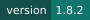
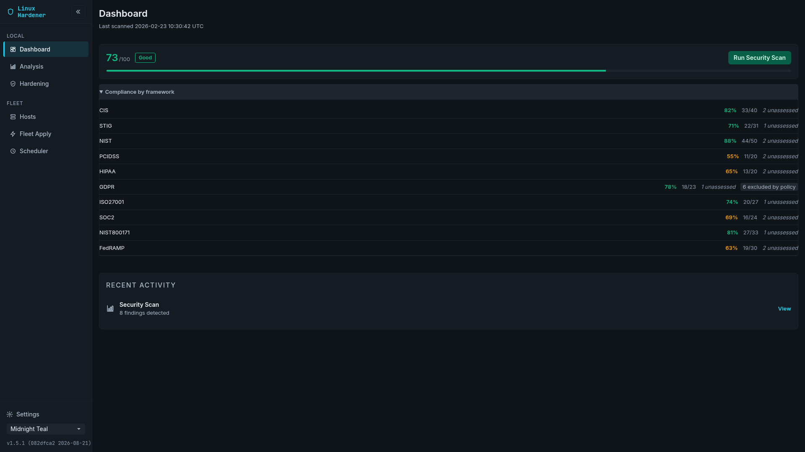
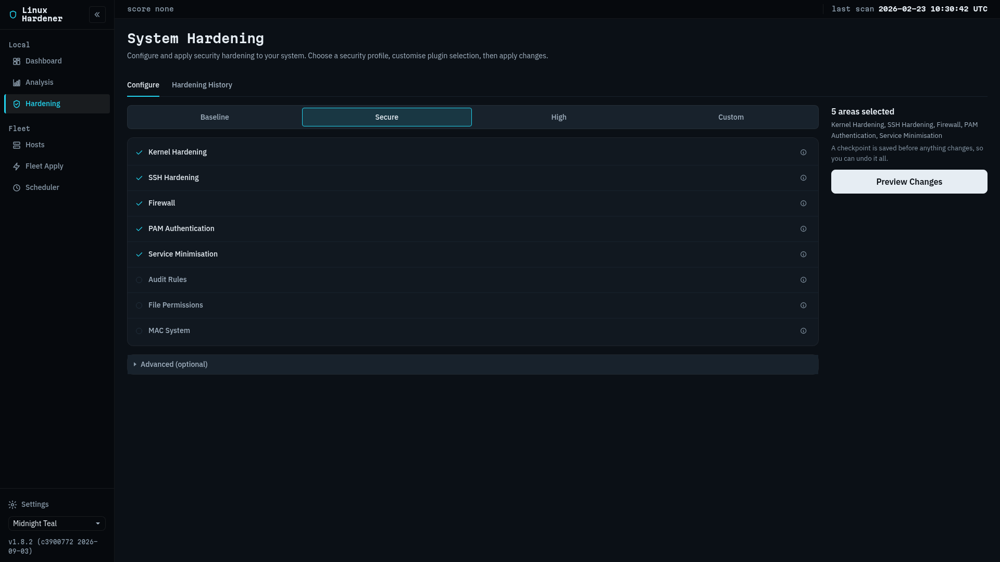
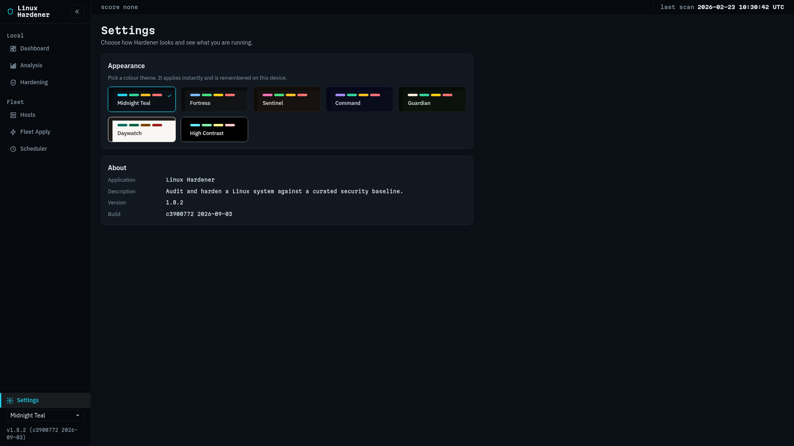
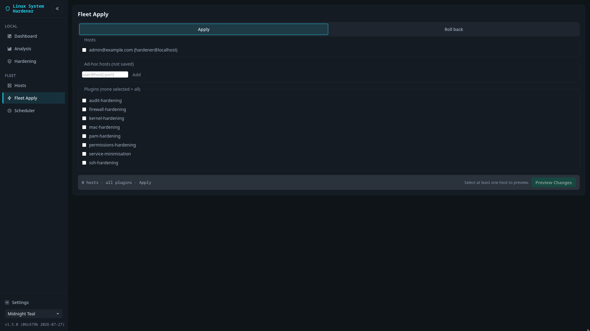
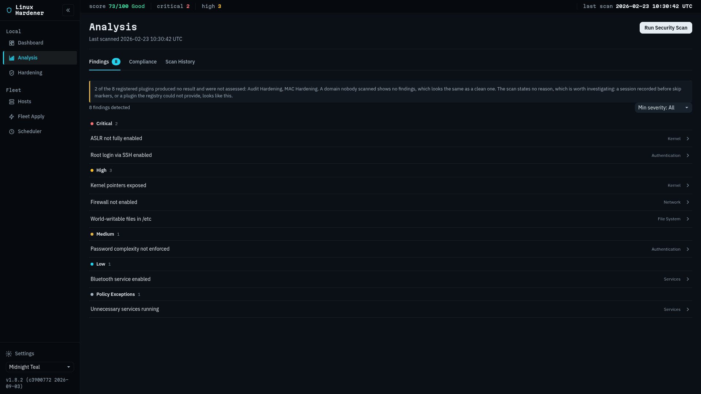
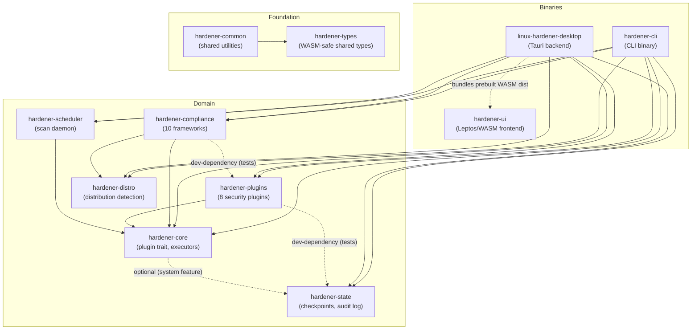

<p align="center">
  <picture>
    <source media="(prefers-color-scheme: dark)" srcset="docs/assets/logo-dark.svg">
    
  </picture>
</p>

<p align="center">
  <a href="https://github.com/tidynest/linux-hardener/actions/workflows/ci.yml"></a>
  
  
  
  <a href="https://aur.archlinux.org/packages/linux-hardener"></a>
  
  
</p>

**Scan a Linux system for security misconfigurations, fix them, and undo the
fix.** Every change is snapshotted before it is made, so `hardener rollback`
puts the host back. Findings map onto ten compliance frameworks, and a control
the engine cannot actually assess is reported as needing manual review rather
than assumed to pass.

Written in Rust. One CLI binary, one desktop application, eight hardening
plugins, four distribution families.

> New here? Start with the [getting started guide](docs/guide/getting-started.md).
> Upgrading from an earlier release? Read [upgrading](docs/guide/upgrading.md)
> first, because some fixes do not repair a host that was already hardened.
> The full documentation index is [docs/README.md](docs/README.md).

---

## Contents

- [Install](#install)
- [First run](#first-run)
- [What it checks](#what-it-checks)
- [Screenshots](#screenshots)
- [Usage](#usage)
- [Configuration](#configuration)
- [How it works](#how-it-works)
- [Security considerations](#security-considerations)
- [Project status](#project-status)
- [Contributing](#contributing)
- [Licence](#licence)

---

## Install

### Arch Linux, from the AUR

```bash
paru -S linux-system-hardener
```

This installs both the `hardener` CLI and the `linux-hardener-desktop` GUI.

The project renamed to `linux-hardener`, but the AUR package has not been
resubmitted under the new name yet, and the AUR does not redirect the way the
git remotes do. Until it lands, `linux-system-hardener` is the package that
exists; installing it now is carried across by the new one's
`provides`/`conflicts`/`replaces` metadata rather than stranding you.

### Everything else

Fedora, RHEL, Debian, Ubuntu and openSUSE packages, a static binary, and an
install from source are all covered in the
[installation guide](docs/guide/installation.md).

### Docker, for a read-only audit

A `FROM scratch` image carrying only the static binary can audit the host
without being able to change it:

```bash
docker build -f packaging/docker/Dockerfile -t linux-hardener .

docker run --rm --pid=host \
  -v /etc:/etc:ro -v /var/log:/var/log:ro -v /usr/lib:/usr/lib:ro \
  linux-hardener scan --format json
```

`apply` is unsupported in a container by design: it would need `--privileged`
plus host namespaces, which defeats the isolation. Checks that need
`systemctl` or D-Bus degrade to tool-unavailable findings rather than guessing.
Details in [`packaging/docker/README.md`](packaging/docker/README.md).

### From source

Rust 1.88 or newer, with the `wasm32-unknown-unknown` and
`x86_64-unknown-linux-musl` targets plus a musl toolchain for the static binary.

```bash
git clone https://github.com/tidynest/linux-hardener.git
cd linux-hardener
cargo build --release
cargo test
```

Cross-compilation, the desktop build and development mode are in
[docs/contributing/building.md](docs/contributing/building.md).

---

## First run

```bash
hardener scan                      # what is wrong, read-only, no root needed
sudo hardener apply --dry-run --all   # what would change, still changes nothing
sudo hardener apply --all             # change it
sudo hardener checkpoint list         # the snapshot that run just took
```

If something breaks, roll back to the checkpoint that run created:

```bash
sudo hardener rollback <checkpoint-id>
```

The rollback takes its own snapshot first, so it too can be undone.

---

## What it checks

### Security Plugins

| Plugin | What it does |
|---|---|
| **Kernel Hardening** | sysctl parameters: ASLR, ptrace scope, network stack |
| **SSH Hardening** | OpenSSH configuration, including key exchange, cipher and MAC selection intersected with what the host actually supports |
| **Firewall Hardening** | rules and default policy across nftables, firewalld and ufw |
| **PAM Authentication Hardening** | password quality, lockout, history and ageing |
| **Service Minimisation** | disables services that need not be running |
| **Audit Rules Hardening** | auditd rule files (`auditd.conf` is checkpointed but not modified) |
| **File Permissions Hardening** | modes and ownership on account, boot and authentication paths |
| **MAC System Hardening** | SELinux and AppArmor detection and status. SELinux changes are runtime-only, and AppArmor reports manual steps rather than editing profiles |

### Compliance frameworks

Findings are mapped onto CIS, STIG, NIST 800-53, PCI-DSS, HIPAA, GDPR,
ISO/IEC 27001:2022, SOC 2 Trust Services Criteria, NIST SP 800-171 Revision 3
and FedRAMP (Moderate, Rev 5 baseline).

Coverage is declared per control by the plugin that would assess it. A control
no plugin covers is reported as **Manual Review**, never as a pass, so a report
cannot claim compliance the tool did not measure. RHEL-10-family hosts are
assessed against DISA RHEL 10 STIG V1R1 and CIS RHEL 10 Benchmark v1.0.1
identifiers automatically; `--profile` overrides that.

### Supported distributions

| Distribution | Package manager | Init | Status |
|---|---|---|---|
| Debian 12 and later (incl. 13 "Trixie") | apt | systemd | validated on 13 |
| Ubuntu 22.04 LTS and later (incl. 26.04) | apt | systemd | validated on 24.04 LTS |
| Fedora 40 and later (incl. 44) | dnf | systemd | validated on 44 |
| RHEL 9 and later (incl. 10) | dnf | systemd | validated on Rocky 10 |
| Arch Linux (rolling) | pacman | systemd | validated on rolling |
| openSUSE Leap 15.6 / 16, Tumbleweed | zypper | systemd | validated on Leap 16, see below |

**Validated** means a dated end-to-end run against a container of that
distribution, 149 checks, recorded in
[distribution-validation.md](docs/reference/distribution-validation.md). Ubuntu
joined that list on 2026-08-07, when its container ran the cross-distro suite
under `--apply --booted` and the differential suite, both passing. Its
cross-distro counts are identical to the other five; its differential counts
match the other four but not Arch, which records two fewer askable rows because
its shadow build has no minimum-password-age field. **That is a property of
Arch, not a shortfall of Ubuntu**, and this sentence said "identical to the
other five" of both suites until 2026-08-18.

Support is **family-based**: any release of the Debian, Red Hat, Arch or SUSE
families maps to the same hardening behaviour, so current releases are covered
without a code change. That routing is why Ubuntu is listed at all, and it is a
design decision rather than a measurement: the tool accepts nineteen
distribution identifiers and six have ever been run. Which are which, and what
follows from it, is in
[what this release does not prove](docs/reference/what-is-not-proven.md).
openSUSE Leap 15.x reached end of life in April 2026; use Leap 16.

**openSUSE keeps packaged configuration under `/usr/etc`** and reserves `/etc`
for administrator overrides, where an `/etc` file overrides the vendor copy as a
whole file rather than setting by setting. The tool reads both layers. SSH
assesses whichever `sshd_config` is in force and hardens through a drop-in, so
the vendor file's own `Include` lines survive. PAM creates its `/etc` copy from
the vendor file before editing it, so the settings it does not manage survive
too.

One manual step remains, in the permissions plugin: where `/etc` holds nothing
it assesses the `/usr/etc` copy and reports a violating mode there, but it never
writes a package-owned file, because a package update would revert the change.
The finding prints the command that copies the file into `/etc` for you. See the
[troubleshooting guide](docs/guide/troubleshooting.md#scan-reports-a-permissions-finding-under-usretc-and-apply-changes-nothing).

---

## Screenshots

<p align="center">
  
</p>
<p align="center">
  
  
</p>
<p align="center">
  
  
</p>

<p align="center"><sub>The real Leptos/WASM interface on the Midnight Teal theme, captured at 1.5.1 (2026-08-21) against the test fixture rather than a live scan, which is why the hosts read <code>web-01</code> and <code>db-01</code>. The fixture is <code>gui-tests/tauri-mock.js</code>, held to the Rust types by <code>validate_gui_mock_fixtures.py</code> and driven by the 165-case Playwright suite, so these are reproducible on any machine and contain no data from anyone's system. The Hosts and Scheduler screens are in <a href="docs/assets/screenshots/">docs/assets/screenshots</a>, along with the states these five do not reach: the finding detail expander, the per-control compliance view, the checkpoint timeline and its rollback confirmation, the expanded host panel, and the two Scheduler notes that appear only while scheduled scanning is off.</sub></p>

---

## Usage

### Command line

The commands you will use most:

```bash
hardener plugins                        # List available security plugins
hardener scan                           # Scan the system for security issues
hardener scan --format json             # Machine-readable scan output
hardener report --framework cis         # Compliance report for one framework of ten
sudo hardener apply --dry-run --all     # Preview hardening without changing anything
sudo hardener apply --all               # Apply all recommended hardening
sudo hardener checkpoint list           # List rollback checkpoints
sudo hardener rollback <checkpoint-id>  # Roll back to a checkpoint
hardener history list                   # Recent scan sessions
```

The rest of the surface at a glance. Every command and flag is documented in the
[CLI reference](docs/reference/cli.md):

```bash
# Checkpoints: create, inspect, prune
sudo hardener checkpoint create "before-hardening"
sudo hardener checkpoint show <checkpoint-id>
sudo hardener checkpoint delete <checkpoint-id>

# History: sessions, per-host trends, CI regression gate
hardener history show <session-id>
hardener history export <session-id> --output export.json
hardener history trends --host web-01
hardener history regressions            # Exit 1 when any host got worse
hardener --quiet history regressions    # Script-friendly quiet output

# Policy exceptions: accept a single finding as a documented deviation
sudo hardener exception add mac-hardening mac-present --reason "no MAC system on this image"
sudo hardener exception remove mac-hardening mac-present

# Scope: declare a control not applicable, so it leaves the score's denominator
sudo hardener scope exclude iso27001 7.1 --reason "no premises; cloud-hosted"
sudo hardener scope exclude iso27001 7.1 --reason "..." --host web-01 --host web-02
sudo hardener scope include iso27001 7.1

# Scheduled scanning: daemon and systemd timer
hardener daemon start                   # Blocks; run-once and status also available
hardener daemon run-once
hardener daemon status
hardener systemd generate               # Print unit files
sudo hardener systemd install           # Daily timer, or --user
hardener systemd status
sudo hardener systemd uninstall

# Remote and fleet operations over SSH
hardener --ssh admin@server --port 22 --ssh-key ~/.ssh/id_ed25519 --ssh-timeout 30 scan
hardener --config /etc/linux-hardener/config.toml scan
hardener batch scan --all               # Every inventory host, concurrently
hardener batch report --all --framework cis
hardener batch apply --all              # Dry-run by default; add --execute
sudo hardener batch rollback --host web-01,web-02 --plugin ssh --execute
```

`batch apply` and `batch rollback` are **dry-run by default**: they validate and
preview, and change nothing until `--execute` is given. Under `--execute` every
host is privilege-probed first, so an unprivileged host fails in isolation. The
dry run does not probe, since it changes nothing.

SSH authentication is key or agent based. There is no password path, and
`BatchMode=yes` is passed at the ssh layer, so a password-only host fails at
connect rather than prompting. Details in
[SSH remote scanning](docs/guide/ssh-remote-scanning.md); the host inventory
lives at `~/.config/linux-hardener/hosts.toml`.

### Desktop application

1. Launch the application.
2. Run a security scan.
3. Review findings by severity: Critical, High, Medium, Low.
4. Select what to apply on the **Hardening** page.
5. Apply. This asks for a root password through polkit. The button reads
   "Nothing to Apply" when the selection would change nothing.
6. Roll back from **Hardening History** if needed.

Seven pages, reached from the grouped left sidebar. Seven colour themes,
including a light theme and a WCAG AAA high-contrast theme.

| Shortcut | Action |
|---|---|
| Ctrl+1 to Ctrl+5 | Dashboard, Analysis, Hardening, Hosts, Scheduler |
| Ctrl+Shift+S | Run a scan from any page |
| Alt+T | Cycle themes |
| Escape | Close detail panels, exit fullscreen |
| F11 | Toggle fullscreen |
| Arrow keys | Move within tab bars and segmented controls |
| Enter or Space | Open a finding |

Fleet Apply and Settings have no shortcut yet. The interface is built against
WAI-ARIA: tab semantics, a skip link, live regions and managed focus.

The frontend also builds as a browser application through Trunk, which renders
every page but cannot scan, apply or report, since those need the Tauri backend.
It is for interface development.

---

## Configuration

Loaded from four sources, each overriding the last:

1. `/etc/linux-hardener/config.toml`
2. `~/.config/linux-hardener/config.toml`, **read only when not running as root**
3. `--config /path/to/file.toml`
4. `HARDENER_*` environment variables

The user file is skipped under root deliberately, so an unprivileged user's
config cannot steer a privileged run. That means `sudo hardener apply` ignores
`~/.config/linux-hardener/config.toml` entirely. To apply a config as root, put
it in `/etc/linux-hardener/` or pass `--config`, which is always honoured.

```toml
# /etc/linux-hardener/config.toml

[global]
disabled_plugins = ["mac-hardening"]

# Document an accepted deviation, with an audit trail
[ssh.exceptions.PasswordAuthentication]
value = "yes"
allowed = true
reason = "Legacy LDAP integration until Q2 2027 migration"
expires = "2027-06-30"
```

Two scan modes interact with the configuration. The default applies `directives`
overrides and reports what happened to each configured exception: one that
matches the host annotates its finding, one that does not, because its value
no longer matches or it expired, leaves the finding live with a line
explaining why. `hardener scan --audit` ignores the configuration entirely and
measures against the unmodified baseline. It is `hardener report` that treats
an annotated finding as satisfied for a compliance control, while still
listing it as evidence.

Every section, key and default is in the
[configuration reference](docs/reference/configuration.md).

---

## How it works

A scan asks each plugin what it can observe. An apply asks each plugin to write
what it can change, after taking a checkpoint of every path it might touch. A
rollback restores from that checkpoint, taking a fresh one first so the undo is
itself reversible.

Checkpoints are Ed25519-signed rows in SQLite. The audit log is a hash chain, so
a deleted or edited entry does not verify.



Edges to `hardener-common` and `hardener-types` are omitted for clarity except
where they are the only dependency: `hardener-ui` takes `hardener-types` alone
because it compiles to WASM, and `hardener-distro` takes `hardener-common`
alone. Dotted edges are an optional feature, a WASM bundle or a dev-dependency.

The full picture, including the executor abstraction that lets every plugin run
against a local or a remote host unchanged, is in
[architecture.md](docs/architecture/architecture.md).

---

## Security considerations

### Privilege model

- **Scanning** runs as a normal user wherever it can.
- **Applying** needs root.
- **Checkpoints** live in a signed SQLite database whose location depends on who
  ran the command: root uses `/var/lib/linux-hardener/checkpoints.db`, and a
  normal user gets a separate database under their own data directory. Run
  `checkpoint` and `rollback` with the same privilege you applied with, or you
  will be reading a different database from the one that was written.

### What it defends against

Kernel-level exploitation, network exposure, privilege escalation through PAM
and file permissions, lateral movement through unnecessary services, and audit
evasion.

### Known limitations

- Some changes need a reboot to take full effect.
- Some hardening breaks specific applications. Test in staging.
- SELinux and AppArmor policies are detected, not managed.
- Not every finding is one `apply` can act on. Where a distribution layers its
  configuration, a permissions finding can name a package-owned file under
  `/usr/etc` that the tool deliberately never writes. `scan` reports it and
  prints the command that copies it into `/etc`; `apply` stays silent about it
  by design.
- `scan --format json` reports a plugin whose scan failed identically to one
  that passed, because the per-plugin success flag is not serialised. The text
  output does name such a plugin.

Open defects are tracked as
[GitHub issues](https://github.com/tidynest/linux-hardener/issues),
including the ones not yet fixed, so the risk is yours to judge rather than
mine to summarise.

Those are the limits that are **known**. The limits of what has been
**measured** are a different question and a separate document, written for
someone deciding whether to run this on a host that matters:
[what this release does not prove](docs/reference/what-is-not-proven.md). It
names, among other things, the two plugins whose applies no independent oracle
has ever read back, and that `apply --all` includes both of them anyway.

---

## Project status

**This page describes `main`.** The tree is well ahead of the newest release,
and where the two differ this page follows the tree.

### Releases

**Version**: 1.5.1

Install a release unless you have a reason not to. Per-release detail is in
[CHANGELOG.md](CHANGELOG.md), and anything a release fixed that your already
hardened host still carries is in [upgrading](docs/guide/upgrading.md).

### Tests

```
Rust workspace (cargo nextest run --workspace):  2267 passed, 0 failed, 42 skipped
```

The 42 skipped tests need root, a live SSH host, or a specific firewall backend,
so they run only inside the test containers. Beyond the workspace suite there is
a cross-distribution suite that applies and rolls back on six booted
containers, and a differential suite that compares the host before and after an
apply through an oracle independent of the tool. Both are described in
[testing.md](docs/contributing/testing.md) and
[scripts/README.md](scripts/README.md).

The browser-level end-to-end suite was rewritten against the redesigned
interface ([#48](https://github.com/tidynest/linux-hardener/issues/48), closed
2026-08-08). It last ran green on all six distributions on 2026-08-16, and runs
only inside the containers, through `scripts/test/gui/run-gui-tests.sh`, which
refuses a `dist/` older than the frontend source so that a stale bundle cannot
pass tests written for a change. Dated readings of it are in
[what-is-not-proven.md](docs/reference/what-is-not-proven.md).

A test count says how much ran, not what it asked. What each capability's
evidence actually asks, and the grade of that evidence, is in the
[evidence ledger](docs/reference/evidence-ledger.md); what no test reaches is in
the [coverage baseline](docs/reference/coverage-baseline.md); and what the
release therefore cannot claim is in
[what this release does not prove](docs/reference/what-is-not-proven.md).

---

## Contributing

Contributions are welcome. Start with [CONTRIBUTING.md](CONTRIBUTING.md).

- Naming follows [naming-conventions.md](docs/reference/naming-conventions.md).
- `cargo clippy --workspace --all-targets -- -D warnings` must pass.
- New code carries tests, and a test that passes against the unfixed code is not
  evidence.
- British English in prose and user-facing text.

Issues labelled
[good first issue](https://github.com/tidynest/linux-hardener/issues?q=is%3Aissue+is%3Aopen+label%3A%22good+first+issue%22)
are self-contained and have the pattern to copy named in the body.

Milestones, shipped and planned, are in [docs/ROADMAP.md](docs/ROADMAP.md).

---

## Licence

Apache License, Version 2.0. See [LICENSE](LICENSE).

## Acknowledgements

Drawing on [Lynis](https://cisofy.com/lynis/),
[OpenSCAP](https://www.open-scap.org/) and the
[CIS Benchmarks](https://www.cisecurity.org/cis-benchmarks).

---

**Author**: Eric Jingryd
**Contact**: tidynest@proton.me
**Repository**: https://github.com/tidynest/linux-hardener

**Last Updated**: 2026-08-27
